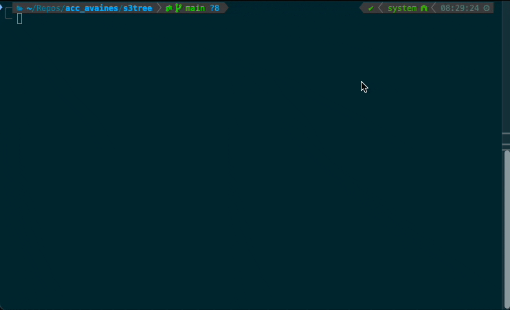
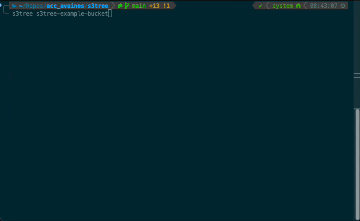

# S3Tree

[](https://github.com/avaines/s3tree/actions/workflows/main.yml)


A CLI tool to list contents of S3 buckets in a tree-like format, similar to the Unix `tree` command.

---

## Features

- Visualizes S3 bucket contents as a directory tree
- Supports filtering, sorting, and formatting options
- Supports AWS region and role assumption
- Supports text, json, and yaml output



---

## Installation

```bash
npm install -g s3tree-cli
```

## Usage

```bash
s3tree [options] <bucket-name>
```

**Example:**

```bash
s3tree my-bucket -d -f --region eu-west-2
```

---

## CLI Options

| Option               | Alias | Description                                                |
| -------------------- | ----- | ---------------------------------------------------------- |
| `--date`             | `-D`  | Print the date of the last modification time for each file |
| `--directories-only` | `-d`  | List directories only                                      |
| `--file-limit`       | `-F`  | Do not descend directories with more than # entries        |
| `--full-path`        | `-f`  | Print the full path prefix for each file                   |
| `--max-depth`        | `-L`  | Max display depth of the directory tree                    |
| `--output`           | `-o`  | Output format: `text` (default), `json`, `yaml`            |
| `--region`           | `-r`  | AWS region of the S3 bucket (default: us-east-1)           |
| `--role-arn`         | `-a`  | AWS IAM Role ARN to assume for S3 access                   |
| `--size`             | `-s`  | Print the size of each file in bytes                       |
| `--sort-time`        | `-t`  | Sort the output by last modification time                  |
| `--help`             |       | Show help                                                  |
| `--version`          |       | Show version                                               |

---

## Output Formats

You can choose the output format using `--output` or `-o`:

- `text` (default): ASCII tree view
- `json`: Raw tree object as JSON
- `yaml`: Raw tree object as YAML


**Examples:**

```bash
s3tree my-bucket -o text
s3tree my-bucket -o json
s3tree my-bucket -o yaml
```

---

## Local Development

1. **Clone the repo and install dependencies:**
    ```bash
    git clone <repo-url>
    cd s3tree-cli
    npm install
    ```

2. **Run locally without global install:**
    ```bash
    node src/index.js <bucket-name> [options]
    ```

3. **Symlink for global development (optional):**
    ```bash
    npm link
    # Now you can use `s3tree` globally
    ```

---

## Running Tests

This project uses [Jest](https://jestjs.io/):

```bash
npm test
```

---

## AWS Credentials

`s3tree-cli` uses your default AWS credentials (from environment or `~/.aws/credentials`).  
You can also specify a role to assume with `--role-arn`.

---

## License

MIT

---

## Author

Aiden Vaines
